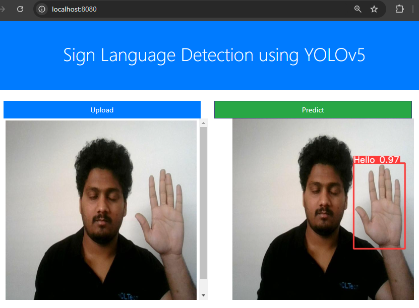

# Sign-Language-Detection-using-YOLOv5
## Project Intro
1. Problem Statement
2. Data Collection
3. Image Annotation
4. Data Preparation
5. Train model
6. Model Evaluation
7. Deployment

# Demo
- 
- 
- 
- 
- 

## Statement 
- The main point of this application is to use cameras to recognize gestures from the sign language to offer a new means of communication. The program will be able to transcribe gestures done by dump people into written words printed on the screen.

## Data Collection
- Data Collection : Collected custom dataset of 2,244 training images and 213 validation images
- Image Annotation : Used bounding box annotation by using roboflow.com 

## Data Ingestion using Github 
- Ingested data in zip file from Github to Local. Then extracted the zip file with Train, Test and data.yaml file.
- 

## Data Validation
- The data ingestion returns [Train, Test, data.yaml] file in the form of artifact. 
- The data valdiation pipeline validates whether those file are present or not.
- If the artifact [Train, Test, data.yaml] file is present we return True and start the model trainer. If not present we return False and raise exception.
- 

## Model Trainer
- Used the YOLOv5 model from the github repo.
- changed the yolov5/models/yolov5s.yaml to the number of classes : 6
- Then we trained the model with 300 epochs, batch size 16, with the command : 
```bash
!python train.py --img 416 --batch 16 --epochs 300 --data '../data.yaml' --cfg ./models/custom_yolov5s.yaml --weights 'yolov5s.pt' --name yolov5s_results  --cache
```
- Achieved the result summary as : 
    - Best epoch : 286
    - Mean Average Precision : 0.992
    - Precision : 0.992
    - Box loss : 0.01333
    - Class loss : 0.00178
    - Object loss : 0.00497
- 

## Model Pusher
- Pushed the model.pt to out S3 bucket.
- 

## Deployment
- Build docker image of the source code
- Push our docker image to ECR
- Launch our EC2
- Pull our image from ECR in EC2
- Launch our docker image in EC2

# Workflows
- Constants
- config_entity
- artifact_entity
- Components
- Pipeline : It will run the 
    1. Data ingestion
    2. Data validation
    3. Model Trainer
    4. Model pusher
- Endpoint : app.py


## Configuration 
- Install aws cli and confugure aws credential (secret key & access key)
```bash
aws configure
```

## How to run :
```bash
conda create -n signlang python=3.7 -y
```

```bash
conda activate signlang
```

```bash
pip install -r requirements.txt
```

```bash
python app.py
```